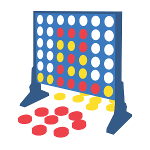
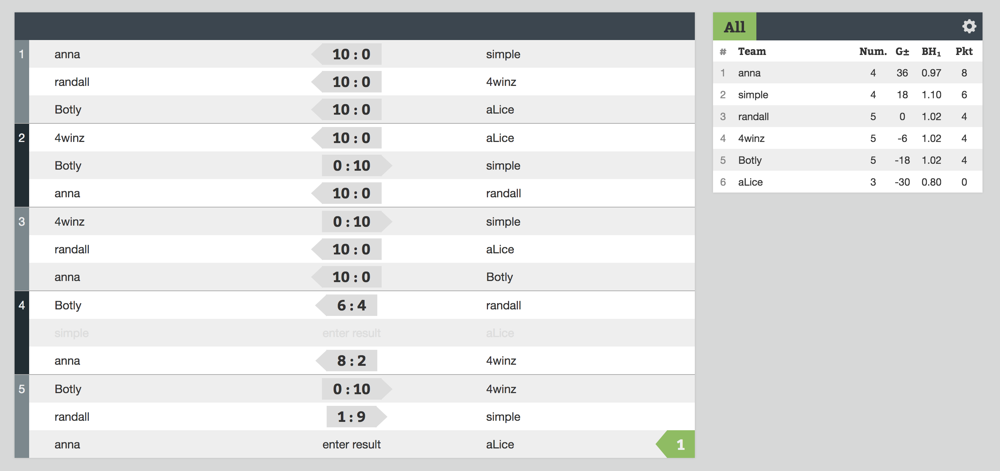
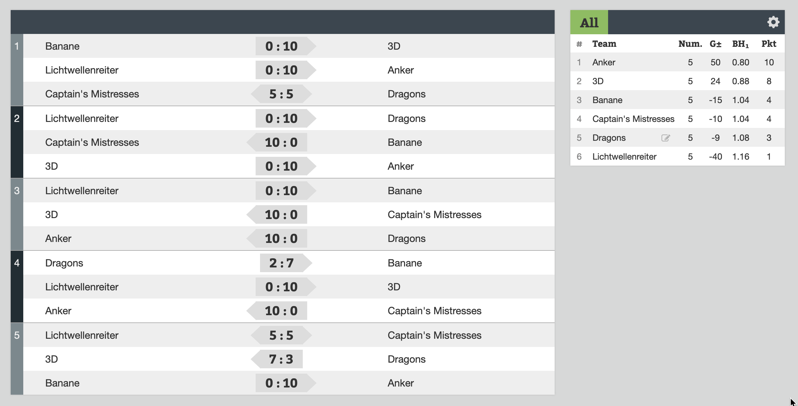

# Connect Four Challenge

_by [Lukas Akermann](https://github.com/lakermann), November 2018_

## Rules

* No manual intervention is allowed
* Time control: max 1 second per move
* Tournament format: [Swiss-system tournament](https://en.wikipedia.org/wiki/Swiss-system_tournament)

## Resources

* [Server](https://github.com/lakermann/connect-four-challenge-server)
* Clients
  * [Java](https://github.com/lakermann/connect-four-challenge-client-java)
  * [Python](https://github.com/lakermann/connect-four-challenge-client-python)
* [Tournament Management](https://kickertool.com)

## Results

### November 2018

### March 2019

